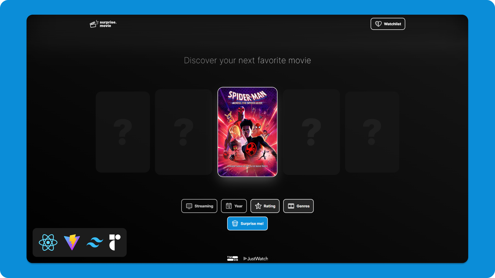

# surprise.movie

Sophisticated movie generator SPA that features different filters and a watchlist exclusively recommending highly-rated films. It integrates modern design principles and connects to the TMDB and JustWatch APIs for comprehensive movie data.

> [!NOTE]
> This project is subject to a rewrite with [Remix](https://remix.run/) and small design changes, making it more performant, easier to maintain, and more visually appealing. The new version will be available soon and can be tracked in the [dedicated branch](https://github.com/nikolailehbrink/surprise.movie/tree/remix).



## ✨ Features

- **Movie Recommendations**: Get a random movie recommendation based on your preferences, including streaming provider, genre and release year.
- **Watchlist**: Add movies to your watchlist and keep track of your favorite films. No account required!
- **Detail Pages**: View detailed information about each movie, including the cast, the trailer and streaming options.

## 🛠️ Technologies

- **Single Page Application (SPA)**: Built with [React](https://react.dev/), [Vite](https://vitejs.dev/), [Wouter](https://github.com/molefrog/wouter), and [React Helmet](https://github.com/staylor/react-helmet-async) for a seamless user experience.
- **Modern Design**: Styled using [Tailwind CSS](https://tailwindcss.com/) and components from [shadcn/ui](https://ui.shadcn.com/), ensuring a visually appealing and responsive interface.
- **API Integration**: Connects to [TMDB API](https://developer.themoviedb.org/reference/intro/getting-started) and [JustWatch API](https://www.justwatch.com/) for accessing a vast database of movies and related information.
- **Native Fetch with ofetch**: Utilizes native fetch enhanced with [ofetch](https://github.com/unjs/ofetch) for efficient and reliable data fetching.
- **Toast Notifications**: Implements [React Hot Toast](https://react-hot-toast.com/) for elegant toast notifications.

## 📖 Open Source and Contribution

surprise.movie is an open-source project, aimed at demonstrating how to create a single-page application (SPA) with specific features mentioned above. It serves as an educational resource for developers interested in building similar applications or learning about these technologies.

### Contributing to the Project

I welcome contributions from developers of all skill levels. If you're interested in contributing, you can:

- Fork the repository and create a new branch for your feature or fix.
- Submit a pull request with a clear description of your changes or new features.

### Reporting Bugs

Your feedback and bug reports are valuable. If you encounter any issues while using the application, please report them on the [Issues page](https://github.com/nikolailehbrink/surprise.movie/issues) of the GitHub repository. Provide a detailed description of the issue, steps to reproduce it, and screenshots if possible.

## 💻 Running Locally

Before running the site locally, you will need to obtain an API key from TMDB (The Movie Database). This key is essential for fetching movie data from the TMDB API.

### Obtaining TMDB API Key

1. Create an account or log in to TMDB at [TMDB API Reference](https://developer.themoviedb.org/reference/intro/authentication#api-key-quick-start).
2. Navigate to your account settings and select the API section.
3. Follow the instructions to request an API key.

### Setting Up Environment Variables

Once you have your TMDB API key, you need to set it up in your local environment:

1. Create a file named `.env.local` in the root directory of your project.
2. Add the following line to the file:
   ```bash
   VITE_TMDB_API_KEY=your_tmdb_api_key
   ```
3. Replace `your_tmdb_api_key` with the actual API key you obtained from TMDB.

### Starting the Application

After setting up the API key, you can run the application locally by following these steps:

1. **Clone the repository:**
   ```bash
   git clone https://github.com/nikolailehbrink/surprise.movie
   ```
2. **Navigate to the project directory:**
   ```bash
   cd surprise.movie
   ```
3. **Install dependencies:**
   ```bash
   npm install
   ```
4. **Start the development server:**
   ```bash
   npm run dev
   ```
